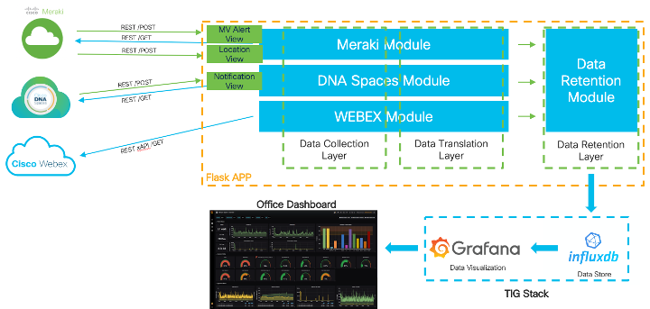

# **WELCOME to OFFICE-DASHBOARD**

## **What is OFFICE-DASHBOARD?**

OFFICE-DASHBOARD is a WEB Dashboard that allows visualization of Key Metrics (KPIs) of real state utilization (Enterprise Workspaces, Retail Stores and others) leveraging Cisco infrastructure as a Sensor.
The use of these metrics can help organizations to prioritize/justify investments in real state based on utilization metrics of its spaces, it also can help better understand employee behaviors and help answer a important but tough question, How is my Office being used?


Example of some metrics:

- What is the busiest time of the day?
- Where are employees concentrating inside the office?
- What is the utilization of my meeting rooms?
- How many employees come in/out every day?
- What are employees mood inside the office?
- What is the Gender/Age profile of the office users?

<br>

## **What are OFFICE-DASHBOARD Components?**

Written in python it leverages [Flask Framework](https://flask.palletsprojects.com/en/1.1.x/) to handle the induvidual data collection modules and the expose urls for data posting from specific cloud services.
Each module has the capability of runninng as a standalone script for testing/troubleshooting scenarios.



<br>

If you want more details about _Office Dashboard_ check this **[post](https://netdevopsmadeeasy.com/office-dashboard/)** with detailed explanation.

### **Meraki Module**

This module is responsible for data collection and data translation of Meraki Cloud service. It uses **[Meraki SDK](https://developer.cisco.com/meraki/api/#python-meraki)** to simplify coding and error handling and has 5 major functions:
1. **find_meraki_dashboard_info** - Responsible for Collecting DASHBOARD information.
2. **find_meraki_client_info** - Responsible for Collecting User/Client information from Dashboard.
3. **find_meraki_camera_info** - Responsible for Collecting MV Cameras information from Dashboard.
4. **analyze_camera_alert** - This function will be triggered when you are running the full APP using FLASK, and it will be responsible for getting the screenshot of the MV Alerts and send it to AWS Rekognition API for analysis.
5. **save_meraki_location** - This function will be triggered when you are running the full APP using FLASK, and it will be responsible for receiving Location data posted by the dashboard and manipulate the format so it can be flatten.

For this module to work, you will need:
1. A Meraki API Key
2. A Meraki Org ID. If you don't know what is your org id run the script as standalone and it will find it for you.
3. An AWS Account, with a valid Key id, Access key and region.
4. Have your Merahi Dashboard configured to send MV Alerts and Location data.

If you want more details on the _Office Dashboard -  Meraki Module_ or need detailed instructions on how to get all you need for this module to work, check this **[post](https://netdevopsmadeeasy.com/office-dashboard/)** with a step-by-step explanation.

Here is how to run the module as standalone.

```console
(venv)$ python3 modules/meraki.py
```

>**Note:** Make sure you look at [Installing](#Installing) Section of this file to have the proper credentials in place.

### **WEBEX Module**

This module is responsible for data collection and data translation of Webex xAPI service available on Webex Room Devices. In this project we decided to use WEBEX Cloud xAPI as a broker to talk to the devices,to simplify inventory authentication and communication.

Within the module there are 2 major functions:
1. **get_webex_device_details** - Responsible for Collecting information from dvices via WEBEX Cloud.
2. **get_webex_token** - Responsible for generating a new token to access Webex Cloud API.

For this module to work, you will need:
1. A WEBEX Integration APP credentials

If you want more details on the _Office Dashboard - WEBEX Module_ or need detailed instructions on how to get all you need for this module to work, check this **[post](https://netdevopsmadeeasy.com/office-dashboard/)** with a step-by-step explanation.

Here is how to run the module as standalone.

```console
(venv)$ python3 modules/webex.py
```

>**Note:** Make sure you look at [Installing](#Installing) Section of this file to have the proper credentials.

### **DNA Spaces Module**

This module is responsible for data collection and data translation of DNA Spaces location information and alerts.

Within the module there are 2 major functions:
1. **  ** - .
2. **  ** - .

For this module to work, you will need:
1. A DNA Spaces API Token

If you want more details on the _Office Dashboard - DNA Spaces Module_ or need detailed instructions on how to get all you need for this module to work, check this **[post](https://netdevopsmadeeasy.com/office-dashboard/)** with a step-by-step explanation.

Here is how to run the module as standalone.

```console
(venv)$ python3 modules/dnaspaces.py
```

>**Note:** Make sure you look at [Installing](#Installing) Section of this file to have the proper credentials.

### **Data Retention Module**

This module is responsible for making data persitency. It will allow you to save data in two formats:
- Log files into logs directory
- InfluxDB database (You will need to install InfluxDB, check [Installing TIG Stack Instructions](https://netdevopsmadeeasy.com/setting-up-your-tig-stack/))

To configure how you want data to be saved, edit credentials file (check [Installing](#Installing) section) and change save_file variable.
- True for log files
- False for InfluxDB

If you want more details on the _Office Dashboard - Data Retention Module_ or need detailed instructions on how to get all you need for this module to work, check this **[post](https://netdevopsmadeeasy.com/office-dashboard/)** with a step-by-step explanation.

>**Note:** Make sure you look at [Installing](#Installing) Section of this file to have the proper settings on credentials file.

<br>

## **How to install OFFICE-DASHBOARD?**

### **Prerequisites**

- MAC, Linux (not supported on Windows)
- python 3.x
- pip package manager (https://pip.pypa.io/en/stable/installing/)

>**Note:** Check this **[post](https://netdevopsmadeeasy.com/office-dashboard/)** to setup a Linux VM as your development environment.

If already installed, make sure that pip / setuptools are upto date (commands may vary)

```bash
    pip install --upgrade pip

    Ubuntu: sudo pip install --upgrade setuptools
```

- virtualenv (recommended)

```bash
    Ubuntu: sudo apt-get install python-virtualenv
    Fedora: sudo dnf install python-virtualenv
    MAC: sudo pip install virtualenv
```

### **Installing**

Step 1: Clone code repository

```bash
git clone https://github.com/diegogsoares/OFFICE-DASHBOARD.git
cd OFFICE-DASHBOARD
```

Setp 2: Setup Virtual Environment

```bash
python3 -m venv venv
source venv/bin/activate
```

Step 3: Install requirements

```bash
python3 -m pip install -r requirements.txt 
```

Step 4: Copy credentials_example.py to credentials.py so all APP/Module parameters can be configured.

```bash
cp credentials_example.py credentials.py 
```

Step 5: Edit credentials.py file and add your credentials

```bash
vi credentials.py 
or
nano credentials.py
```

>**Note:** I personally like to use a more robust file editor called nano 

### **Testing / Running APP**

#### Testing Meraki Module

```console
(venv)$ python3 modules/meraki.py
```

approximated expected output:

```console
Expected output
```

#### Testing Webex Module

```console
(venv)$ python3 modules/webex.py
```

approximated expected output:

```console
Expected output
```

#### Testing DNA Spaces Module

```console
(venv)$ python3 modules/dnaspaces.py
```

approximated expected output:

```console
Expected output
```

#### Running OFFICE-DASHBOARD APP

```console
(venv)$ python3 new-app.py
```

approximated expected output:

```console
Expected output
```

<br>

>**Note:** You will need influxDB and Grafana installed and running on the same host was your code is runninng. Check the posts below:
- [Installing TIG Stack Instructions](https://netdevopsmadeeasy.com/setting-up-your-tig-stack/)

<br>

## **Built With**

- [Visual Studio Code](https://code.visualstudio.com/) - Python IDE

<br>

## **Contributing**

none

<br>

## **Authors**

- **Diego Soares** - _Initial work_
  - [GITHUB account](https://github.com/diegogsoares) &nbsp;
  - [BLOG netdevopsmadeeasy.com](https://netdevopsmadeeasy.com/about-me/)

See also the list of [contributors] who participated in this project.

<br>

## **License**

This project is licensed under the GPLv2 License - see the [LICENSE](https://github.com/diegogsoares/OFFICE-DASHBOARD/blob/master/LICENSE) file for details

<br>

## **Acknowledgments**

- BIG THANK YOU to all my CISCO customers that challenged me with use cases.
